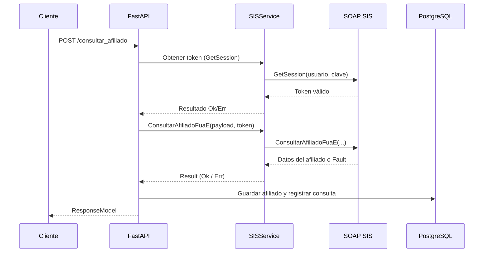

# Arquitectura del microservicio

SIS-MS sigue una arquitectura por capas donde la capa HTTP expone operaciones
REST y delega la lógica de negocio a servicios especializados. A continuación se
describen los componentes principales y cómo interactúan entre sí.

## Componentes principales

| Componente                         | Ubicación                                | Responsabilidad |
| ---------------------------------- | ---------------------------------------- | --------------- |
| FastAPI (`app/main.py`)            | Capa de entrada HTTP, define rutas, CORS y ciclo de vida. |
| Modelos de petición                | `app/api/requests.py` valida la entrada con Pydantic. |
| Servicio SOAP (`SISService`)       | `app/services/sis_service.py` crea un cliente `zeep` reutilizable y orquesta `GetSession`/`ConsultarAfiliadoFuaE`. |
| Servicio de afiliados              | `app/services/afiliado_service.py` aplica estrategia de caché y registra las consultas. |
| Repositorios                       | `app/repositories/*` encapsulan operaciones con `SQLModel`. |
| Modelos persistentes               | `app/models/afiliado.py` y `app/models/consulta.py` definen el esquema relacional. |
| Configuración de base de datos     | `app/database.py` construye el motor de SQLAlchemy, gestiona sesiones y pruebas de salud. |
| Manejo de errores                  | `app/api/exceptions.py` + paquete `api_exception` proveen códigos y respuestas consistentes. |

## Flujo de una consulta

### Estrategia de caché

`AfiliadoService` consulta primero el repositorio `ConsultaRepository` para saber
si el documento fue consultado durante el día en curso (`verificar_consulta_hoy`).
Si es así se recupera el registro desde la tabla `afiliado`, se marca la
consulta como local (`es_local = True`) y se responde inmediatamente. En caso
contrario se llama a `SISService`, se realiza un *upsert* del afiliado y se
registra la consulta con los metadatos y errores (si existieran).

### Integración SOAP

- `SISService` crea un cliente `zeep.Client` único mediante `@lru_cache`, evitando
  re-construir el WSDL en cada petición.
- `get_session` encapsula los posibles fallos y traduce las excepciones en
  `Result` (`Ok`/`Err`).
- `consultar_afiliado_fuae` serializa la respuesta SOAP en un modelo `Afiliado`.
  Si `IdError` es distinto de "0", se considera un error y se devuelve un código
  `API-422` con el detalle.

### Persistencia

- `DatabaseConfig` centraliza las credenciales y parámetros del pool de
  conexiones. El motor se crea *lazy* y se recicla durante el apagado de la app.
- `AfiliadoRepository.guardar_o_actualizar` implementa un patrón *upsert* manual:
  actualiza los campos del registro existente o inserta uno nuevo si no existe.
- `ConsultaRepository.registrar_consulta` almacena el resultado de cada petición
  con la hora exacta (`ZoneInfo("America/Lima")`).

### Gestión de errores

`CustomExceptionCode` define códigos legibles (`API-401`, `API-422`, etc.) y
mensajes humanamente interpretables. `register_exception_handlers` del paquete
`api_exception` asegura que cualquier error controlado se devuelva con el mismo
contrato JSON (`ResponseModel`). El servicio añade trazas en el log cuando se
presentan fallos para facilitar el *troubleshooting*.

## Dependencias externas

- **FastAPI / Pydantic:** exposición HTTP y validación de datos.
- **SQLModel / SQLAlchemy:** acceso a PostgreSQL y ejecución de migraciones con
  Alembic.
- **result:** simplifica la propagación de errores sin lanzar excepciones.
- **zeep:** cliente SOAP compatible con WSDL.
- **api_exception:** capa de abstracción para respuestas uniformes.
- **Logger personalizado (`tools/logger`)**: formato coloreado local y soporte
  opcional para Google Cloud Logging.

## Recomendaciones de extensión

- Para añadir nuevos endpoints crea un módulo en `app/api` y define un servicio o
  repositorio específico antes de exponerlo en `app/main.py`.
- Si necesitas almacenar más campos devueltos por el SIS, extiende el modelo
  `Afiliado` y genera una migración con Alembic.
- Agrega *middlewares* de métricas o autenticación según las necesidades de tu
  plataforma (por ejemplo, JWT en un *gateway* externo).
