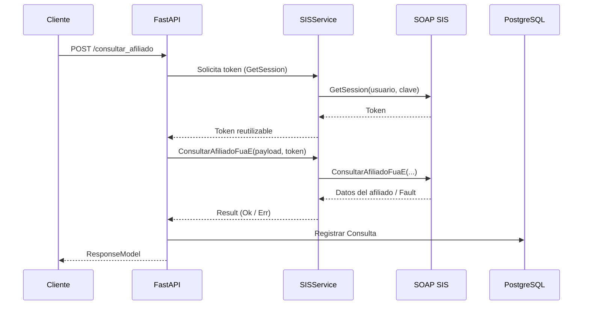

# Arquitectura del microservicio

SIS-MS sigue una arquitectura limpia basada en capas para desacoplar la capa HTTP de la lógica que interactúa con el SOAP del SIS
y con PostgreSQL.

## Componentes principales

| Componente                     | Ubicación                        | Responsabilidad clave                                                  |
| ----------------------------- | -------------------------------- | ---------------------------------------------------------------------- |
| Aplicación FastAPI            | `app/main.py`                    | Define endpoints, middleware CORS y ciclo de vida (`lifespan`).        |
| Servicio SIS (`SISService`)   | `app/services/sis_service.py`    | Administra el cliente SOAP, sesiones y traducción de respuestas.       |
| Modelos Pydantic              | `app/api/requests.py`, `app/models/afiliado.py` | Validan payloads de entrada y salida.                    |
| Persistencia (`Consulta`)     | `app/models/consulta.py`         | Modelo SQLModel que registra cada consulta realizada.                  |
| Configuración de base de datos| `app/database.py`                | Construye la URL de PostgreSQL y expone sesiones transaccionales.      |
| Manejo de errores             | `app/api/exceptions.py` + `api_exception` | Define códigos de error y respuestas estandarizadas.          |
| Migraciones                   | `app/migrations/`                | Scripts de Alembic para evolucionar el esquema.                        |

## Flujo de una consulta



- El cliente SOAP se crea una sola vez gracias a `@lru_cache` (`get_soap_client`).
- Se utiliza el patrón `Result` para encapsular resultados y errores sin excepciones intermedias.
- El registro de la consulta se realiza incluso cuando ocurre un error, preservando trazabilidad.

## Manejo del ciclo de vida

`lifespan` en `app/main.py` se ejecuta durante el arranque y cierre de la aplicación:

1. Muestra mensajes informativos en consola.
2. Verifica la conectividad con PostgreSQL usando `DatabaseConfig.test_connection()`.
3. Permite añadir lógica de *shutdown* (liberación de recursos, métricas, etc.).

## Estándares de respuesta y logging

- El middleware de `api_exception` registra automáticamente las excepciones y genera un `ResponseModel` coherente.
- Los logs se emiten con la configuración básica de Python (`logging.basicConfig(level=logging.INFO)`), lo que facilita la
  integración con herramientas externas (por ejemplo, Google Cloud Logging).

## Diagrama de despliegue sugerido

```
[Cliente REST] ---> [SIS-MS (Uvicorn/Gunicorn)] ---> [Servicio SOAP del SIS]
                                   |
                                   +--> [PostgreSQL gestionado]
```

Ajusta la topología según tu plataforma (Kubernetes, Docker Compose, máquinas virtuales, etc.).
